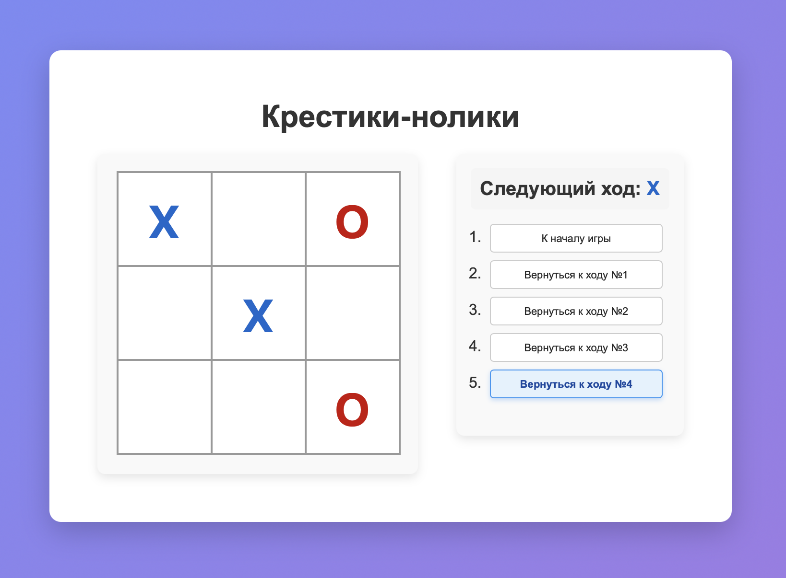

# Игра «Крестики-нолики»

Простая реализация классической игры «Крестики-нолики» с использованием React и Vite.

## Функциональность

- Игра для двух игроков (X и O)
- Синие крестики и красные нолики
- История ходов с возможностью возврата к любому ходу
- Автоматическое определение победителя или ничьей
- Интерфейс на русском языке

## Технологии

- React
- JavaScript
- CSS
- Vite

## Запуск проекта

```bash
# Установка зависимостей
npm install

# Запуск в режиме разработки
npm run dev

# Сборка для продакшена
npm run build
```

## Скриншот



## Процесс разработки

Проект был создан в учебных целях для практики работы с React и состоянием компонентов.
